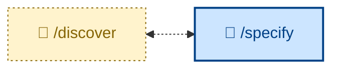

# 🧑 `/discover`

Run a discovery workshop with the user to elicit product requirements.

This is a structured chat session that turns a vague business need into a clear set of product requirements. The session is highly interactive (🧑). The agent acts as a business analyst and interviews the user – who answers as the customer, either directly or by relaying what real customers have said.

`/discover` is an OPTIONAL step before `/specify`. The output from `/discover` is a product requirements document (PRD) – covering the outcome, stakeholders, scope, business rules with examples, non-functional requirements, assumptions, and open questions – which becomes the input to `/specify`.

Use `/discover` if the product requirements are vague, ambiguous, or unclear in any way – or if you just need help writing the PRD for any other reason.

The scope of `/discover` is strictly business requirements discovery, not formal specification or design.

If the requirements are already clearly articulated in a written artifact, you can skip straight to `/specify`. If the requirements specification is done, you can skip further ahead to `/design`.

## How to invoke

- `/discover`, `/skill:discover` (prompt varies by agent harness).
- `/discover <URL or path to existing business requirements artifacts>`
- "Let's discover the requirements for…"
- "Run a discovery session on…"
- "Help me understand what the customer actually needs."
- "Interview me about this feature."

## References

- [Example Mapping](https://cucumber.io/blog/bdd/example-mapping-introduction/) (Matt Wynne, 2015): The core technique – rules, examples, and questions, captured in a single session.

- [Specification by Example](https://gojko.net/books/specification-by-example/) (Gojko Adzic): The broader philosophy – refine requirements through concrete cases, not abstract prose.

- [Impact Mapping](https://www.impactmapping.org/) (Gojko Adzic): Source of the *goal / actor / impact* framing used in the outcome section.
