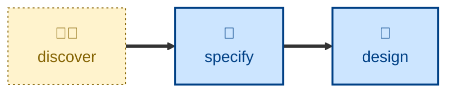

# Discover

Run a discovery workshop with the customer to elicit product requirements.

The agent is instructed to run an interview that turns a vague business need
into a clear product requirements document (PRD) covering the outcome,
stakeholders, scope, business rules with examples and counter-examples,
non-functional requirements, assumptions, and open questions. It acts as a
business analyst, and the user answers as the customer — either directly, or
by relaying what real customers have said.

The agent is told to hold the line on two things in particular: everything
stays in business language, and the session stops at the PRD. It does not
write acceptance criteria, propose a design, or touch code.

Use this skill when the product requirements are vague, ambiguous, or unclear
in any way, or when you simply need help writing the PRD.

## Interactivity

This skill is interactive. The agent runs a back-and-forth interview with the
user, asking one question at a time and waiting for each answer, so it is not
suited to unattended or CI use.

## How to invoke

> Let's discover the requirements for…

> Run a discovery session on…

> Help me understand what the customer actually needs.

> Interview me about this feature.

You can seed the session by pointing the agent at an existing draft — a file
path, a URL, or pasted text — and it will ask whether to refine that draft in
place or to build a fresh PRD from it.

## Recommended models

A frontier model with strong conversational reasoning. The value here is in
the follow-up questions: noticing a vague answer, spotting a contradiction
between two rules, and pushing for the counter-example that pins a boundary
down. Smaller models tend to accept the first answer and move on.

## Suggested workflows

Run this before any specification work, and re-run it when a feature's
requirements turn out to be less settled than assumed. It is not a per-change
step — a PRD covers a capability, not a commit.

## Related skills

- [**specify**](../specify/) \
  Turns the PRD's rules and examples into testable acceptance criteria. This
  skill deliberately stops short of that.

## References

- [Example Mapping](https://cucumber.io/blog/bdd/example-mapping-introduction/)
  (Matt Wynne, 2015): The core technique — rules, examples, and questions,
  captured in a discovery session.

- [Specification by Example](https://gojko.net/books/specification-by-example/)
  (Gojko Adzic): The broader philosophy — refine requirements through concrete
  cases, not abstract prose.

- [Impact Mapping](https://www.impactmapping.org/) (Gojko Adzic): Source of the
  *goal / actor / impact* framing used in the outcome section.
