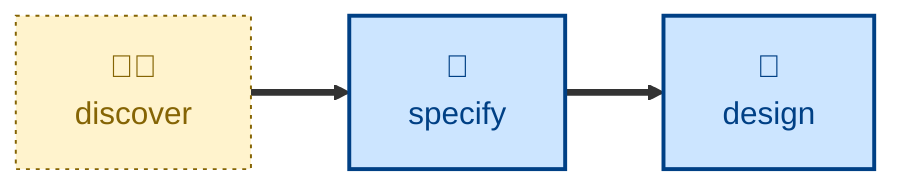

# Discover

The **discover** skill is all about running a discovery workshop with the
customer to elicit product requirements.

The agent is instructed to run an interactive workshop that turns a vague
business need into a clear product requirements document (PRD) covering the
outcome, stakeholders, scope, business rules with examples, non-functional
requirements, assumptions, and open questions.

The agent acts as a business analyst and interviews the user, who answers as the
customer, either directly or by relaying what real customers have said.

Use this skill when the product requirements are vague, ambiguous, or unclear in
any way, or when you simply need help writing the PRD.

## Interactivity

This skill is interactive. The agent runs a back-and-forth interview with the
user.

## How to invoke

> Let's discover the requirements for…

> Run a discovery session on…

> Help me understand what the customer actually needs.

> Interview me about this feature.

## Recommended models

A frontier model with strong conversational reasoning is best suited to this
task.

## Suggested workflows

## Related skills

- **[specify](../specify/)** turns the resulting PRD into acceptance criteria.

## References

- [Example Mapping](https://cucumber.io/blog/bdd/example-mapping-introduction/)
  (Matt Wynne, 2015): The core technique — rules, examples, and questions,
  captured in a discovery session.

- [Specification by Example](https://gojko.net/books/specification-by-example/)
  (Gojko Adzic): The broader philosophy — refine requirements through concrete
  cases, not abstract prose.

- [Impact Mapping](https://www.impactmapping.org/) (Gojko Adzic): Source of the
  *goal / actor / impact* framing used in the outcome section.
