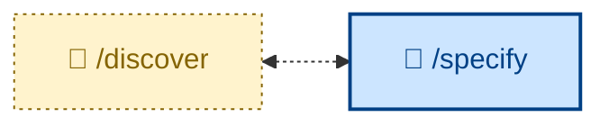

# 🧑 `/discover`

Run a discovery workshop with the customer to elicit product requirements – a structured session that turns a vague business need into a clear discovery report. Interactive (🧑): it interviews the customer directly. Use `/discover` *before* writing a specification, when the requirements themselves are still unclear and an interview is needed to draw them out.

## What it does

The agent acts as a business analyst and interviews the user – who answers as the customer, either directly or by relaying what real customers said. It asks **one question at a time**, letting each answer shape the next, working through a fixed arc:

- **Confirm the seed** – restate the capability under discussion before digging in.
- **Surface the outcome** – the goal, why now, and the measurable change that means success (the Impact Mapping layer that keeps the *why* alive downstream).
- **Identify stakeholders** – who's affected, who decides, whose work changes.
- **Establish scope** – pushing hard for an explicit *out-of-scope* list, not just what's in.
- **Elicit rules** – the things that must always be true or never happen, each a numbered declarative sentence.
- **Draw out examples and counter-examples** – for every rule, a concrete case where it applies and one that looks similar but doesn't, in plain language (the Example Mapping core).
- **Separate assumptions from observations**, and **park open questions** with named owners rather than stalling.

The output is a **discovery report**: Outcome, Stakeholders, Scope, Rules, Examples, Assumptions, Open questions – in business language, with no Gherkin and no technical detail. This report is the project's PRD in all but name, and it is *transient*: it is the input from which a durable specification is later produced, and is superseded by it. `/discover` itself files nothing in a workflow repository.

It carries the rules that keep an interview honest: one question at a time, no leading questions, stay in business language, don't volunteer solutions, push back rather than rubber-stamp, and treat counter-examples as mandatory.

## How to invoke

Ask the agent to run discovery or explore requirements – eg. *"let's discover the requirements for X"*, *"run a discovery session on Y"*, *"help me understand what the customer actually needs here"*, or *"interview me about this feature"*. The skill triggers when a need is too vague to specify directly.

Use it only for *business* discovery: interrogating a draft **design** and making technology choices are separate, technical responsibilities. If the requirements are already clear, skip straight to writing the specification.

## Examples

- **Vague feature request:** *"We want some kind of loyalty scheme."* → an interview that surfaces the goal, the rules (tiers, thresholds), worked examples and counter-examples, and an out-of-scope list – ready to specify from.

- **Relaying customer conversations:** *"I spoke to three warehouse managers last week – let's discover the requirements."* → the user answers as the customer; the report captures rules, assumptions to validate, and open questions with owners.

- **Sharpening a fuzzy rule:** *"Free delivery for premium customers."* → the counter-example questions expose the boundary (*does a lapsed premium member qualify? a £600 cart with a returned item?*) before any criteria are written.
