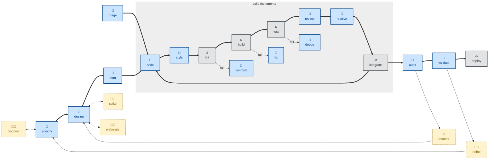

# 🧑 `discover`

This skill runs an interactive product requirements discovery workshop with the user (🧑).

It is a structured chat session that turns a vague business need into a clear product requirements document (PRD) — covering the outcome, stakeholders, scope, business rules with examples, non-functional requirements, assumptions, and open questions.

The agent acts as a business analyst and interviews the user, who answers as the customer, either directly or by relaying what real customers have said.

Use this skill if the product requirements are vague, ambiguous, or unclear in any way, or if you just need help writing the PRD for any other reason.

The scope of the skill is confined to business requirements discovery. Formal specification and design and design are expressly out-of-scope. If the requirements are already clearly articulated in a written artifact, you can skip ahead to `specify`, which will take that artifact as input.

## How to invoke

- `/discover`, `/skill:discover` (prompts vary by harness).
- `/discover <URL or path to existing business requirements artifacts>`
- "Let's discover the requirements for…"
- "Run a discovery session on…"
- "Help me understand what the customer actually needs."
- "Interview me about this feature."

## Recommended models

Requirements elicitation is an interactive, ambiguity-resolving conversation, best run on a frontier model with strong conversational reasoning. The skill needs to notice when an answer is vague, contradictory, or incomplete and probe further — a capability that degrades noticeably in smaller models.

## References

- [Example Mapping](https://cucumber.io/blog/bdd/example-mapping-introduction/) (Matt Wynne, 2015): The core technique — rules, examples, and questions, captured in a single session.

- [Specification by Example](https://gojko.net/books/specification-by-example/) (Gojko Adzic): The broader philosophy — refine requirements through concrete cases, not abstract prose.

- [Impact Mapping](https://www.impactmapping.org/) (Gojko Adzic): Source of the *goal / actor / impact* framing used in the outcome section.
