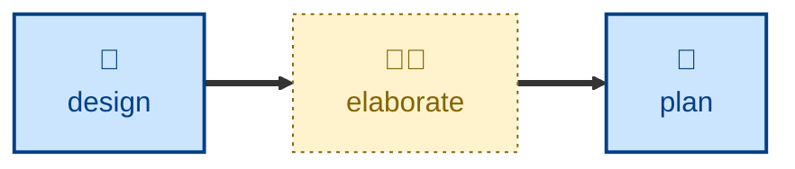

# Elaborate

The **elaborate** skill is all about refining a proposed solution by
interrogating the design docs. It is a highly interactive session with one
objective: to nail down an architectural design and mitigate the major risks
within it.

For input it requires architectural design artifacts — anything in a textual
format (some models will also process images). The agent interrogates the
design, then interviews the user one question at a time on the rationale for the
design choices. Each question carries a recommended answer, so the user can agree
quickly or articulate a disagreement. The agent sharpens fuzzy terms, probes
assertions with concrete scenarios, and surfaces contradictions between the
stated design and what the code actually does.

## Interactivity

This skill is interactive; it interviews the user one question at a time.

## How to invoke

> Interrogate this design.

> Grill me on this draft.

> Stress-test this design before we build it.

## Recommended models

A frontier reasoning model is best suited to this task.

## Suggested workflows

## Related skills

- **[design](../design/)** supplies the draft architectural changes this skill interrogates.
- **[plan](../plan/)** decomposes the sharpened design once elaboration is done.

## References

- [Matt Pocock's `grill-me` skill](https://github.com/mattpocock/skills/blob/main/skills/productivity/grill-me/SKILL.md)
  is the inspiration for this one.

- The name of this skill is taken from the elaboration phase in the
  [Unified Process](https://www.amazon.co.uk/dp/0201571692). The goal of this
  phase is to establish and validate a proposed system architecture.
