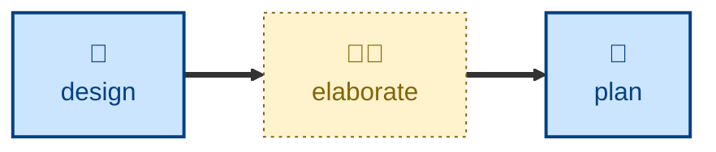

# Elaborate

The **elaborate** skill refines a proposed solution by interrogating the design
documentation. It is a highly interactive session with one objective: to nail
down an architectural design and mitigate the major risks within it.

For input it needs a draft design in any textual format (some models will also
process images), plus access to the code that design would touch. The agent
reads the draft, maps its open decisions in dependency order, then interviews
the user one question at a time on the rationale behind each choice. Every
question carries a recommended answer, so the user can agree quickly or
articulate a disagreement. Along the way the agent pins down fuzzy terms in the
project's glossary, probes assertions with concrete scenarios, and surfaces
contradictions between the stated design and what the code actually does.

The agent writes only to the glossary, the project's decision store, and the
draft itself. It does not touch application code, and it stops short of
decomposing the design into implementation increments.

## Interactivity

This skill is interactive. It interviews the user one question at a time and
waits for each answer before continuing, so it is not suitable for unattended
or away-from-keyboard runs. The agent also prompts for anything it cannot
discover on its own, such as where the glossary and decision store live.

## How to invoke

> Interrogate this design.

> Grill me on this draft.

> Stress-test this design before we build it.

## Recommended models

A frontier reasoning model is best suited to this task. The work is open-ended
analysis — spotting unstated assumptions, judging which decisions genuinely
warrant a record, and holding a long multi-turn interview on track.

## Suggested workflows

Run this once a draft design exists but before anyone breaks it into
implementation steps. Running it earlier wastes the interview on a design that
has not yet taken a position; running it later means re-deciding work already
decomposed.

## Related skills

- [**design**](../design/) \
  Produces the draft architectural change that this skill interrogates.

- [**plan**](../plan/) \
  Decomposes the sharpened design into implementation increments once
  elaboration is done.

- [**decide**](../decide/) \
  Writes up a single decision in full, where elaboration surfaces one too
  large to settle in the interview.

## References

- [Matt Pocock's `grill-me` skill](https://github.com/mattpocock/skills/blob/main/skills/productivity/grill-me/SKILL.md)
  is the inspiration for this one.

- The name of this skill is taken from the elaboration phase in the
  [Unified Process](https://www.amazon.co.uk/dp/0201571692). The goal of this
  phase is to establish and validate a proposed system architecture.
