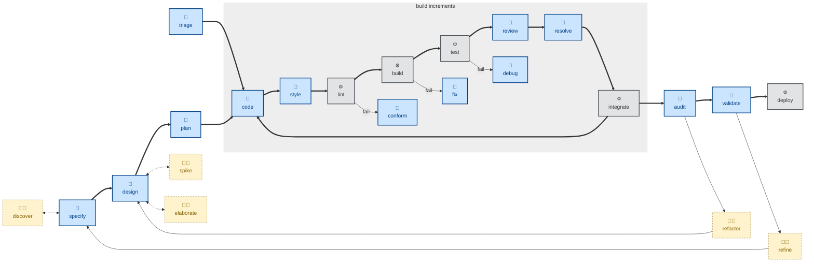

# 🧑 `elaborate`

This is a highly interactive session (🧑), involving lots of back-and-forth between the agent and the user, with one objective: to nail down an architectural design and mitigate major risks within it.

For input, the agent requires architectural design artifacts — anything in a textual formats (some models will also process images). The skill instructs the agent to interrogate the design, and then interview the user, one question at a time, on the rationale for the design choices.

Each question carries a recommended answer, so the user can agree quickly or articulate a disagreement.

The agent is instructed to sharpen fuzzy terms, probe assertions with concrete scenarios, and surface contradictions between the stated design and what the code actually does.

## How to invoke

- `/elaborate`, `/skill:elaborate` (prompts vary by harness).
- "Interrogate this design."
- "Grill me on this draft."
- "Stress-test this design before we build it."

## References

- Inspired by Matt Pocock's [`grill-me`](https://github.com/mattpocock/skills/blob/main/skills/productivity/grill-me/SKILL.md) skill.

- The name of this skill is taken from the elaboration phase in the [Unified Process](https://www.amazon.co.uk/dp/0201571692). The goal of this phase is to establish and validate a proposed system architecture.
