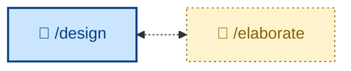

# 🧑 `/elaborate`

Refine a proposed solution by interrogating its design – interviewing the user one question at a time to stress-test a draft and turn a sketch into a design that survives implementation. Interactive (🧑): expect a back-and-forth. Use after a draft design exists and before it is decomposed into steps, when it still has ambiguities, unstated assumptions, or contested terms.



## What it does

`/elaborate` is an interactive conversation, and the discipline is the point: one question, wait for the answer, then the next – never batched. It loads the draft, the related ACs, and the relevant code first, maps the open decisions into a dependency tree, and walks it parents-first. Each question is precise and carries a recommended answer with one-line reasoning, so the user can agree quickly or articulate the disagreement. It sharpens fuzzy terms inline (updating `docs/domain-model.md`), probes assertions with concrete scenarios, and surfaces contradictions between the stated design and what the code actually does – its highest-leverage findings. Settled decisions are captured immediately: glossary terms to the domain model, and ADRs only for decisions that are hard to reverse, surprising, and the result of a real trade-off.

It prefers reading the code over asking whenever a question is answerable from the source, spending the user's time only on intent, trade-offs, and constraints.

## How to invoke

```
/elaborate
```

Invoke it after a draft design exists (an ADR, design doc, or PR description) and before decomposition, while it still has soft edges. It is interactive – expect a back-and-forth, not a one-shot report. No arguments beyond pointing it at the draft.

## Examples

Reading "cancellation revokes the order", `/elaborate` offers two readings – status-only (what the code does today) versus status-plus-refund – leans toward the refund reading because the spec mentions a refund flow, and asks which is meant. When the user confirms refunds (partial, when only some items were paid), it queues the follow-ups (instrument vs store credit; what happens when the refund fails), updates the "Cancellation" glossary entry inline, and moves on.

It ends when every open decision is resolved or explicitly deferred, terms match the glossary, and no code-versus-design contradictions remain – reporting either a decomposition-ready design or, if elaboration exposed a structural flaw, that the draft needs rework before proceeding.
