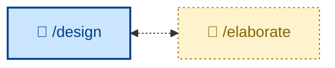

# 🧑 `/elaborate`

<!-- Interactive: refine design docs. Outcome is still a PR to approve/reject by the user. -->

Refine a proposed solution by interrogating its design – interviewing the user one question at a time to stress-test a draft and turn a sketch into a design that survives implementation. Interactive (🧑): expect a back-and-forth. Use after a draft design exists and before it is decomposed into steps, when it still has ambiguities, unstated assumptions, or contested terms.

## What it does

`/elaborate` interrogates a draft design to stress-test it before it is decomposed into steps. It is an interactive conversation, and the discipline is the point: one question, wait for the answer, then the next – never batched. Each question carries a recommended answer, so the user can agree quickly or articulate the disagreement. It sharpens fuzzy terms, probes assertions with concrete scenarios, and surfaces contradictions between the stated design and what the code actually does. The outcome is a decomposition-ready design – open decisions resolved or deferred, terms reconciled, qualifying decisions captured as ADRs.

It prefers reading the code over asking whenever a question is answerable from the source, spending the user's time only on intent, trade-offs, and constraints.

## How to invoke

Invoke it after a draft design exists (an ADR, design doc, or PR description) and before decomposition, while it still has soft edges. It is interactive – expect a back-and-forth, not a one-shot report.

- `/elaborate`, `/skill:elaborate` (prompt varies by agent harness).
- "Interrogate this design."
- "Grill me on this draft."
- "Stress-test this design before we build it."

## References

- [Original source — mattpocock/skills `grill-me`](https://github.com/mattpocock/skills/blob/main/skills/productivity/grill-me/SKILL.md): The relentless one-question-at-a-time interview pattern this skill is built on.

- [Original source — mattpocock/skills `grill-with-docs`](https://github.com/mattpocock/skills/blob/main/skills/engineering/grill-with-docs/SKILL.md): The doc-update discipline integrated into the grill loop. This skill uses `docs/domain-model.md` rather than mattpocock's `CONTEXT.md` convention.

- [CONTEXT-FORMAT.md](https://github.com/mattpocock/skills/blob/main/skills/engineering/grill-with-docs/CONTEXT-FORMAT.md): The glossary format the `docs/domain-model.md` entries are modeled on. Read for term-style conventions (one or two sentences, aliases to avoid).

- [ADR-FORMAT.md](https://github.com/mattpocock/skills/blob/main/skills/engineering/grill-with-docs/ADR-FORMAT.md): The ADR format and the three-criteria filter for when to write one.
