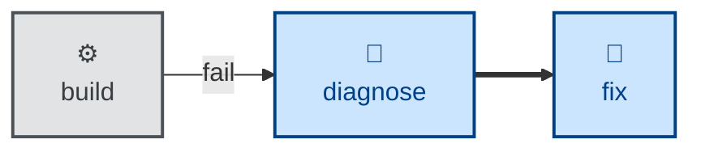

# Fix

The **fix** skill is all about repairing something whose cause is already
known, and proving the repair worked.

The issue may have been raised by a tool (eg. a failing build) or a user.
The solution is already understood — the **[diagnose](../diagnose/)** skill
may be used for this purpose.

## Interactivity

This skill instructs the agent to run non-interactively.

## How to invoke

> Fix the build.

> Fix the lint errors.

> Make the type-checker pass.

> Implement the fix to resolve this known bug.

## Recommended models

A mid-tier coding model is sufficient for mechanical fixes. A more capable
model may be beneficial if the fix changes a large surface area of code.

## Suggested workflows

## Related skills

- **[diagnose](../diagnose/)** finds the underlying cause for an issue.
