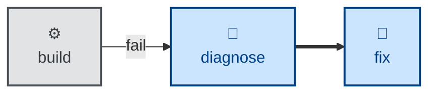

# Fix

Repair something whose cause is already known, and prove the repair worked.

The cause may have been named by a tool — a failing build, compile, lint, or
type-check — or by a completed investigation that reproduced a bug and handed
over a confirmed cause. Either way, no hypothesis remains to be formed.

The skill tells the agent to read the failing tool's output literally rather
than guessing at it, prefer automated fixes where they exist, make the minimal
change at the established location, and then verify in both directions: the
check passes after the change, and a handed-over regression test goes red again
when the change is reverted. Suppressions are allowed but must name the rule
and state why it does not apply. Refactors, renames, and feature work are kept
out of the diff.

Where the cause is still unknown, the skill stops and says so rather than
guessing repeatedly.

## Interactivity

This skill instructs the agent to run non-interactively, so it suits
away-from-keyboard workflows such as CI-triggered repairs. The agent may prompt
only to establish where an artifact lives or how to access it — never to settle
what the task requires. If the requirements cannot be determined, it stops with
an error.

## How to invoke

> Fix the build.

> Fix the lint errors.

> Make the type-checker pass.

> Implement the fix for this known bug.

> Audit the API package for anything broken and fix it.

## Recommended models

A mid-tier coding model is sufficient for mechanical fixes, where the tool's
message is the specification. A frontier model is worth reaching for when the
fix spans a large surface area, when a type or dependency change cascades, or
when acting on a handed-over diagnosis whose causal chain has to be checked
against the code.

## Suggested workflows

Best run as soon as a gate goes red, on its own branch and in its own commit.
It is not a code-review or refactoring pass — running it to tidy code that is
not broken is an anti-pattern.

## Related skills

- [**diagnose**](../diagnose/) \
  Finds the underlying cause of an issue, and hands over a confirmed causal
  chain and a failing regression test that this skill then acts on. Reach for
  it first whenever the cause of a breakage is not already established.
