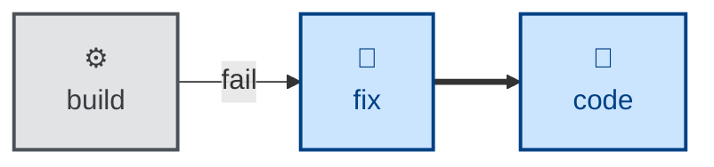

# Fix

The **fix** skill is all about fixing anything generally broken — failing
builds, lint, type-checks, etc. It audits and fixes
anything in the codebase that is broken in an obvious, mechanical way — a failing
build or compile, a linter or type-checker violation, a deprecation warning, a
misconfigured tool.

Unlike **[debug](../debug/)**, there is no hypothesis to form — the cause is
already evident from the tool's own error message, and the task is just to
resolve it. Unlike **[style](../style/)**, which makes subjective presentation
judgment calls, **fix** targets a tool's pass/fail verdict: the check either
passes or it doesn't, and there is nothing to judge.

This skill instructs the agent to run non-interactively.

## How to invoke

> Fix the build.

> Fix the lint errors.

> Make the type-checker pass.

> Implement the fix to resolve this known bug.

## Recommended models

The cause is already known or evident from tool output, so this is mechanical
remediation. A mid-tier coding model is sufficient; frontier reasoning is
unnecessary overhead for well-diagnosed lint, build, or type errors.

## Suggested workflows

**fix** is the failure branch off the build loop's build step (and equally off
lint or the type-checker). Once the tool passes again, the increment rejoins the
loop back at **[code](../code/)**.
