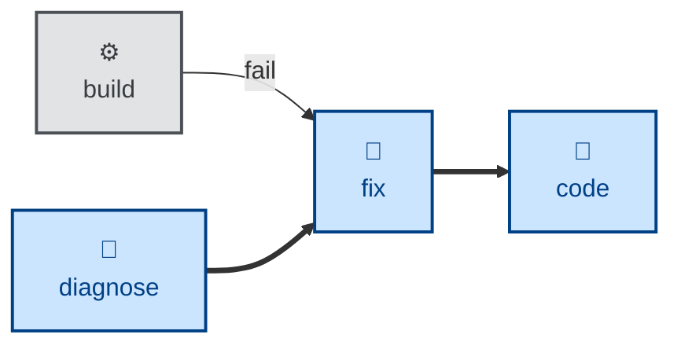

# Fix

The **fix** skill is all about repairing something whose cause is already
known, and proving the repair worked.

## What it does

It handles two kinds of repair, which differ only in where the cause came
from:

- **A tool named it.** A failing build or compile, a linter or type-checker
  violation, a deprecation warning, a misconfigured tool. The error message is
  the spec for the fix.

- **A diagnosis named it.** **[diagnose](../diagnose/)** has already
  reproduced the bug, confirmed the causal chain, and left behind a failing
  regression test. That test is the acceptance criterion: **fix** turns it
  green, then reverts the change to confirm it goes red again. A test that
  passes either way proves nothing.

What both have in common is that no hypothesis remains to be formed. Where
investigation is still needed, the skill is instructed to stop and hand back to
**[diagnose](../diagnose/)** rather than guess — and equally, where a
handed-over diagnosis turns out to be stale or wrong, it reports that rather
than quietly re-deriving it.

Unlike **[style](../style/)**, which makes subjective presentation judgment
calls, **fix** targets a verdict someone else has already reached: the check
either passes or it doesn't, and there is nothing left to judge.

## Interactivity

This skill instructs the agent to run non-interactively.

## How to invoke

> Fix the build.

> Fix the lint errors.

> Make the type-checker pass.

> Implement the fix to resolve this known bug.

## Recommended models

A mid-tier coding model is sufficient for mechanical, tool-reported breakage.
Repairing a diagnosed bug is real code work — the cause is known but the remedy
still has to be designed — so the skill pins a standard coding tier rather than
a basic one.

## Suggested workflows

**fix** is the failure branch off the build loop's build step (and equally off
lint or the type-checker), and the landing point for a completed diagnosis.
Once the tool passes or the regression test is green, the increment rejoins the
loop back at **[code](../code/)**.

## Related skills

- **[diagnose](../diagnose/):** finds the cause when a tool hasn't named it,
  and hands over the failing test this skill turns green.

- **[style](../style/):** distinguishes mechanical pass/fail remediation here
  from subjective presentation judgment there.

- **[code](../code/):** the increment rejoins the build loop here once the
  tool passes again.
