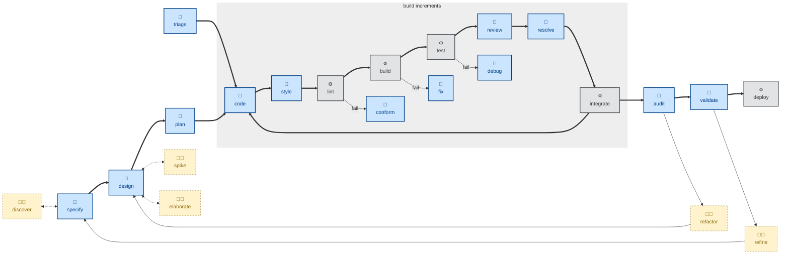

# 🤖 `fix`

This skill audits and fixes anything in the codebase that is broken in an
obvious, mechanical way — a failing build or compile, a linter or type-checker
violation, a deprecation warning, a misconfigured tool.

Unlike [`debug`](../debug/), there is no hypothesis to form — the cause is
already evident from the tool's own error message, and the task is just to
resolve it. Unlike [`style`](../style/), which makes subjective presentation
judgment calls, `fix` targets a tool's pass/fail verdict: the check either
passes or it doesn't, and there is nothing to judge.

This skill instructs the agent to run non-interactively (🤖).

## How to invoke

- `/fix`, `/skill:fix` (prompts vary by harness).
- "Fix the build."
- "Fix the lint errors."
- "Make the type-checker pass."
- "This is broken."

## Recommended models

The cause is already known or evident from tool output, so this is mechanical
remediation. A mid-tier coding model is sufficient; frontier reasoning is
unnecessary overhead for well-diagnosed lint, build, or type errors.
