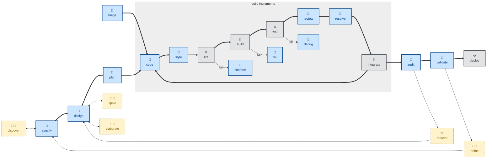

# 🤖 `handoff`

`handoff` = session continuity. It compacts a conversation into an ephemeral handoff document so a fresh agent or sapien can resume the work, capturing just enough state to continue without repeating work, re-litigating decisions, or re-walking dead ends. It references the durable artifacts the work has produced by path or URL rather than duplicating them, drafts a structured document (what's done, what's open, codebase state, next steps, gotchas), redacts secrets, and writes it to the OS temp directory — never the repo, because a handoff is a session bridge, not a project artifact.

Use it when ending a session, switching agents, approaching context limits, or pausing work someone else will resume. With no argument it covers the full state of the current work; an argument scopes the handoff to the next session's focus.

This skill instructs the agent to run non-interactively (🤖).

## How to invoke

- `/handoff`, `/skill:handoff` (prompts vary by harness).
- `/handoff next session continues with the API integration`
- "Hand this off to the next session."
- "Write up where we got to before I stop."

## References

- [Original source — mattpocock/skills `handoff`](https://github.com/mattpocock/skills/blob/main/skills/productivity/handoff/SKILL.md): The skill this one is adapted from.
