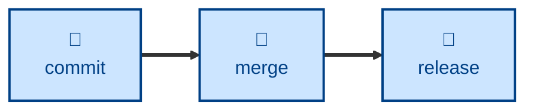

# Merge

The `merge` skill is all about **branch integration**. It applies the project's
branching conventions to integrate a source branch into a target, choosing the
merge strategy by branch type rather than preference — fast-forward, merge
commit, rebase, or squash-merge. It runs pre-merge checks, executes the merge,
resolves conflicts deliberately (watching for *semantic* conflicts that apply
cleanly but break behavior), verifies the merged result builds and tests green,
pushes, and deletes the disposable source branch.

Use it any time work on one branch is being integrated into another. Tell it the
source and target branches. It assumes a clean working tree (stash or commit
first) and picks the strategy from the branch types.

It integrates the work opened by [`branch`](../branch/) and recorded by
[`commit`](../commit/), and promotes trunks toward a [`release`](../release/).

This skill instructs the agent to run non-interactively, and it escalates rather
than improvises: if a trunk fast-forward fails, that signals a workflow
violation, and it stops rather than papering over it.

## How to invoke

> Merge this branch into `dev`.

> Integrate `temp/...` back into the trunk.

> Promote `dev` to `test`.

## Recommended models

Most merges are mechanical (choosing a strategy, resolving trivial conflicts),
which a mid-tier model handles fine. Escalate to a frontier reasoning model only
when conflicts are semantically tangled and resolving them requires
understanding intent on both branches, not just diff lines.

## Suggested workflows

Once commits are complete, `merge` integrates the branch and promotes trunks up
the `dev` → `test` → `ready` chain, from where `release` can ship.
