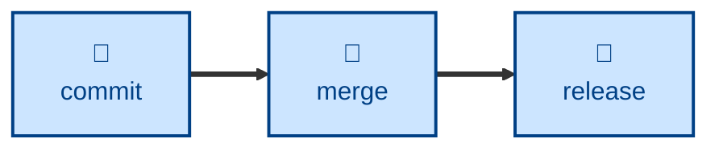

# Merge

The **merge** skill encapsulates the rules for
integrating work between divergent Git branches defined in
[TS-9: Version Control](https://github.com/kieranpotts/standards/tree/latest/dev/src/009).

The skill defines pre-merge checks, provides scripts to execute merges, and
provides guidance on resolving conflicts.

## Interactivity

This skill instructs the agent to run non-interactively. If an error is
encountered (eg. a fast-forward operation fails), the agent is instructed
to escalate rather than improvise a solution.

## How to invoke

> Merge this branch into `dev`.

> Integrate `temp/...` back into the trunk.

> Promote `dev` to `test`.

## Recommended models

A mid-tier model is sufficient for this task. Escalate to a frontier reasoning
model for semantically tangled conflicts.

## Suggested workflows

## Related skills

- **[branch](../branch/)**
- **[commit](../commit/)**
- **[release](../release/)**
