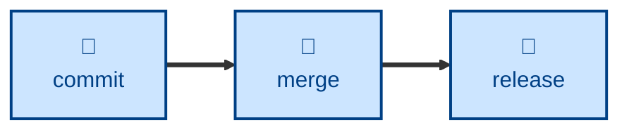

# Merge

The **merge** skill integrates work between two divergent Git branches,
following the reintegration rules of the trunk-based model described in
[TS-9: Version Control](https://github.com/kieranpotts/standards/tree/latest/dev/src/009).

The agent is told to identify the source and target branches, pick the merge
strategy their branch types call for, align and check the source before
merging, resolve any conflicts by hand, verify the merged result locally, and
then push and clean up the disposable branch. It is told to integrate and stop
there — branching, releasing, and versioning stay outside its remit.

## Interactivity

This skill instructs the agent to run non-interactively, so it is safe in
away-from-keyboard workflows. It may ask only where a repository or artifact
lives when the context and environment do not settle it. On any error — a
failed fast-forward, a conflict that reveals a design disagreement — it is
instructed to stop and escalate rather than improvise.

## How to invoke

> Merge this branch into `dev`.

> Integrate `temp/...` back into the trunk.

> Promote `dev` to `test`.

Name both branches where the repository has more than one trunk. The agent
will not guess a target.

## Recommended models

A mid-tier model is sufficient, since the strategy follows mechanically from
the branch types. Escalate to a frontier reasoning model when conflicts are
semantically tangled, or when two long-lived branches have deeply diverged.

## Suggested workflows

Run this skill when a piece of work is finished and verified on its own
branch, not continuously — a trunk promotion on every commit adds churn
without adding integration.

## Related skills

- [**branch**](../branch/) \
  Defines and creates the branches whose types decide the merge strategy
  used here.

- [**commit**](../commit/) \
  Authors the revisions that this skill integrates between branches.

- [**release**](../release/) \
  Cuts release branches from the trunk that this skill fast-forwards.

## References

- [TS-9: Version Control](https://github.com/kieranpotts/standards/tree/latest/dev/src/009) \
  The branching model and reintegration strategies this skill encodes.
