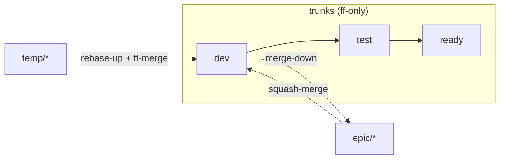

# Merge

Use this skill to integrate commits from one branch into another, applying the project's existing branching convention to pick the right strategy for the branch type. It assumes a working tree with no uncommitted changes — if you have uncommitted work, stash or commit first.

**Merge strategies at-a-glance**:



## Interface

**Input**: A source branch and a target branch, both committed (no uncommitted work) and up to date with their remotes, plus the project's branching convention that maps each branch type to a merge strategy and its commit-message and changelog formats. REQUIRED.

**Interactive**: TODO -  Whether the skill runs non-interactively to completion, or is necessarily interactive — blocking to ask questions, present options, and wait for answers.

**Output**: The target branch updated with the integrated work using the strategy correct for the branch type, conflicts resolved deliberately, tests and build green on the merged result before push, and disposable source branches (`temp/*`, `epic/*`) deleted locally and remotely once landed. The skill integrates and stops; it neither defines the branching convention nor cuts releases.

##  Instructions

1.  **Identify source and target.**

    State both branches explicitly. "Merge into main" is ambiguous when there are multiple trunks. Write it down:

    ```
    Source: temp/482-idempotency
    Target: dev
    ```

    Confirm both exist locally and are up to date with their remotes (`git fetch`).

2.  **Identify the branch type and choose the strategy.**

    Strategy is determined by the branch type, per the project's branching convention:

    | Source → Target              | Strategy                | Command                                  |
    | ---------------------------- | ----------------------- | ---------------------------------------- |
    | `temp/*` → `dev`             | Rebase up, then FF      | `git rebase dev && git merge --ff-only` |
    | `epic/*` → `dev`             | Squash-merge            | `git merge --squash`                     |
    | `dev` → `epic/*`             | Merge commit (no-FF)    | `git merge --no-ff dev`                  |
    | `dev` → `test` → `ready`     | Fast-forward only       | `git merge --ff-only`                    |
    | `ready` → `release` / `release/<v>` | Fast-forward only       | `git merge --ff-only`                    |

    If the situation does not match a row, stop and consult the branching convention before improvising. Picking the wrong strategy (eg. squash-merging a `temp/*`, FF-merging an `epic/*`) corrupts history conventions.

3.  **Pre-merge: align the source.**

    Before merging into the target:

    - *For `temp/*` → `dev`*: rebase the source onto the latest `dev` (`git rebase dev`). This is the "rebase-up" step. The result is a linear history; the FF merge that follows adds no new commit.

    - *For `epic/*` → `dev`*: ensure the latest `dev` has already been merged *down* into the epic (`git checkout epic/x && git merge --no-ff dev`). Conflicts are resolved on the epic side, not at integration time. Then, still on the `epic/*` branch, add a commit that updates `CHANGELOG.md` under the `[Unreleased]` section (using the project's changelog entry format). This commit is squashed in with the rest of the epic's changes and is how the CHANGELOG lands on `dev`.

    - *For trunk-to-trunk*: the upstream trunk MUST be a direct ancestor of the downstream target. If `git merge --ff-only` would fail, do NOT switch to a regular merge — the workflow has been violated, escalate.

4.  **Run pre-merge checks on the source.**

    Before merging:

    - `git status` clean.
    - Tests green on the source branch (run the suite locally or check CI).
    - Commit messages valid per the project's message convention (the validation regex catches most issues).
    - No `WIP` or `TEMPORARY` flagged commits if the target is a shared trunk.

    If any check fails, fix on the source branch and re-run. Do not merge through known-failing state.

5.  **Execute the merge.**

    Run the command from the table. Examples:

    ```sh
    # temp/* into dev (after rebase-up).
    git checkout dev
    git merge --ff-only temp/482-idempotency

    # epic/* into dev (after merge-down from dev into epic).
    git checkout dev
    git merge --squash epic/billing-v2-rewrite
    git commit  # author the squash-commit per the message convention

    # dev down into epic/* (sync).
    git checkout epic/billing-v2-rewrite
    git merge --no-ff dev

    # Trunk forward-promotion.
    git checkout test
    git merge --ff-only dev
    ```

6.  **Resolve conflicts.**

    If the merge stops with conflicts:

    - List them: `git status` shows the conflicted files.
    - Open each, resolve manually. Prefer the change that preserves the target branch's contract over local convenience.
    - Watch for *semantic conflicts*: both sides apply cleanly textually but the combined behavior is wrong (renamed symbol still referenced by the other side, two new functions with the same name in different files, etc.). The compiler / type-checker / test suite catches most of these — run them after each non-trivial resolution.
    - Stage resolutions (`git add <file>`).
    - For rebase: `git rebase --continue`. For merge: `git commit`.

    If a conflict reveals a real design disagreement (not just a textual collision), abort the merge (`git merge --abort` or `git rebase --abort`), discuss with the relevant author, then retry.

7.  **Post-merge: verify.**

    Before pushing:

    ```sh
    # Tests pass on the merged result.
    <your test command>

    # Build / type-check pass.
    <your build command>

    # Quick sanity-check the history.
    git log --oneline -10
    ```

    For trunk merges: confirm history is linear (`git log --oneline --graph -10` shows no merge bubbles).

    For epic merges into `dev`: confirm the squash commit is one commit with a meaningful message.

8.  **Push, then clean up.**

    ```sh
    git push origin <target>

    # Delete the source branch once integrated (temp/* and epic/* are
    # disposable after integration).
    git branch -d temp/482-idempotency
    git push origin --delete temp/482-idempotency
    ```

    Do NOT delete trunks. Trunk branches are permanent.

##  Rules

-   **Strategy is determined by branch type, not by preference.**

    `temp/*` → rebase-up + FF. `epic/*` → squash-merge. Trunks → FF-only. Picking a different strategy violates the branching conventions and corrupts history.

-   **Never use `--no-ff` to forward-promote trunks.**

    `dev` → `test` → `ready` is fast-forward only. A merge bubble in a trunk indicates that a fix was committed downstream — which is forbidden by the trunk model. If `--ff-only` fails on a trunk merge, escalate.

-   **Never squash a `temp/*` branch.**

    Temporary branches preserve their atomic commit history into `dev`. Squashing them defeats the purpose of `step:` commits and loses the per-step rollback granularity.

-   **Resolve conflicts where the work was done.**

    Conflicts between `dev` and `epic/*` are resolved by merging `dev` *down* into the epic, where the epic author has context. They are not resolved at the moment of squash-merge into `dev`.

-   **Run tests after every non-trivial conflict resolution.**

    A textual merge that compiles is not the same as a correct merge. Semantic conflicts are real and only the test suite catches them.

-   **No `--no-verify`, no `--allow-empty`, no `-X theirs`/`-X ours` shortcuts** unless the user has explicitly asked. Skipping hooks or silently preferring one side hides legitimate conflicts.

-   **Push only after the merged result passes locally.**

    Pushing a broken merge to a shared trunk wastes everyone's CI cycle and can block teammates.

-   **Update the CHANGELOG before squash-merging an `epic/*` into `dev`.**

    Add a commit to the `epic/*` branch — after the final merge-down from `dev` — that updates `CHANGELOG.md` under the `[Unreleased]` section. Use the same `type: description` format as a commit subject line. This commit is squashed in with the rest of the epic's changes; do NOT update the CHANGELOG separately on `dev` after the squash.

-   **Clean up integrated branches.**

    `temp/*` and `epic/*` branches are deleted after integration — locally and remotely. Stale branches accumulate and obscure active work.

## Examples

Reintegrating a temp branch:

```sh
# On temp/482-idempotency:
git fetch origin
git rebase origin/dev          # rebase-up; resolve any conflicts here
npm test                        # green
git checkout dev
git merge --ff-only temp/482-idempotency
git push origin dev
git branch -d temp/482-idempotency
git push origin --delete temp/482-idempotency
```

Reintegrating an epic branch:

```sh
# Pre-condition: dev has been merged down into the epic recently.
git checkout dev
git pull --ff-only
git merge --squash epic/billing-v2-rewrite
git commit       # author per the message convention; subject reflects the epic's outcome
npm test         # green on the squashed result
git push origin dev
git branch -D epic/billing-v2-rewrite   # -D because epic is not FF-merged
git push origin --delete epic/billing-v2-rewrite
```

A blocked trunk promotion:

```sh
git checkout test
git merge --ff-only dev
# fatal: Not possible to fast-forward, aborting.

# Diagnosis: test has a commit that is not on dev. Per the branching convention,
# this is a workflow violation — fixes must originate on dev and flow forward.
# Escalate; do not switch to --no-ff to "fix" it.
```

A semantic conflict caught after textual merge:

```sh
git rebase dev
# Both sides applied cleanly. But:
npm test
# FAILS: OrderService no longer has the `parse()` method dev's caller
# expects (it was renamed in the epic). The merge was textually clean
# but semantically broken.

# Resolution: edit the caller to use the new name, stage, continue.
```

##  Edge cases

-   **Merge of two long-running parallel branches with deep divergence.**

    This usually indicates a planning failure rather than a merge problem. If integration is genuinely necessary, prefer merging via the smaller branch onto the larger and squash-merging into `dev` afterward. Do not attempt a giant interactive rebase.

-   **A rebase rewrites already-pushed commits on a shared branch.**

    Don't, unless the branch is explicitly yours. If the source is a shared `epic/*`, do not rebase it — use merge-down to sync, per the rule above.

-   **The source branch's commits don't pass commit-message validation.**

    Fix the messages with `git rebase -i` *before* integration. Once merged, broken messages are in the trunk history.

-   **Conflict marker (`<<<<<<<`) committed by accident.**

    Catastrophic if pushed to a trunk. Add a pre-push hook that greps for conflict markers; treat any positive hit as a hard block. If discovered after push, revert immediately (`git revert`), then re-merge cleanly.

-   **The merge succeeds, tests pass, but production breaks.**

    Treat it as a defect to be diagnosed and fixed downstream, outside this skill. Do not bypass the verification step next time as a result — the failure means something else (test coverage, NFR check) needs strengthening, not that verification is unnecessary.

-   **`epic/*` integration produces an enormous squash diff.**

    Reviewable squash diffs are a feature, not a bug, but huge diffs are unreviewable. If the epic is more than a few hundred LOC of net change, the squash review needs to lean on the design document and the epic's commit history for context. Provide both in the PR description.

##  Success criteria

-   **The strategy used matches the branch type.**

    Per the table in step 2. Document the choice in the merge commit body if it is non-obvious.

-   **The merged result builds and tests green before push.**

    Verified locally, not assumed from CI.

-   **Trunk history is linear after a trunk merge.**

    `git log --oneline --graph` shows no merge bubbles on `dev`, `test`, `ready`, or `release`.

-   **All conflicts were resolved deliberately.**

    No `-X ours`, no `-X theirs`, no skipped hooks. Each resolution was reviewed.

-   **The source branch is deleted after integration.**

    `temp/*` and `epic/*` are gone locally and remotely once landed.

-   **For `epic/*` → `dev`: CHANGELOG updated in a pre-merge commit on the epic branch.**

    The `[Unreleased]` section contains an entry for the epic's changes, committed to the `epic/*` branch before the squash-merge.
