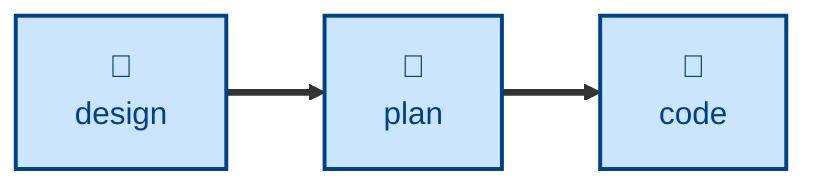

# Plan

The **plan** skill is all about decomposing delivery into small, stable
increments. It
turns a big up-front design into a sequenced checklist of small construction
steps that can be built through an iterative loop — supporting continuous
integration.

Steps are ordered by risk: the unknowns are tackled first, the polish last. It
names the seams where flags, fixtures, or migrations decouple steps. Use it when
the change is substantially larger than a few atomic commits.

This skill instructs the agent to run non-interactively.

## How to invoke

> Break this design into steps.

> Plan the implementation.

> How should we sequence this work?

## Recommended models

Decomposing a design into small, safely sequenced, independently mergeable steps
is a reasoning-heavy planning task. A frontier reasoning model, ideally with
extended thinking, produces materially better sequencing than a mid-tier model,
which tends to under-think dependencies between steps.

## Suggested workflows

**plan** takes the ADRs from **[design](../design/)** and emits an ordered checklist
of steps, each of which **[code](../code/)** picks up one at a time to drive the
build-increments loop.

## Related skills

- **[design](../design/):** supplies the ADRs this skill decomposes into a
  checklist of steps.

- **[code](../code/):** picks up each step this skill produces, one at a
  time.
