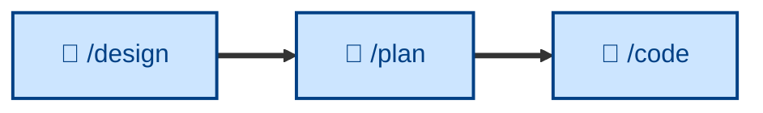

# 🤖 `/plan`

<!-- Design docs approved. Output: implementation plan for approval. -->

Decompose delivery into stable increments – supporting continuous integration – by breaking a designed change into a sequence of small steps, each independently mergeable, testable, and reversible. Runs non-interactively (🤖). Use after the design is agreed and before any implementation, whenever a change is bigger than a single commit or touches multiple seams.

## What it does

`/plan` decomposes an agreed design into a numbered checklist of deliverable steps, each independently mergeable, independently testable, reversible, and small. It orders **by risk, not by ease** – the unknowns first, polish last – and names the seams where flags, fixtures, or migrations decouple steps. The outcome is a plan that is the script for the downstream build loop, consumed one step at a time.

It is non-interactive and produces only the plan – no code. The plan is revisable as each step teaches more.

## How to invoke

Invoke it once the design is captured (and sharpened, if needed) and the change is larger than one atomic commit. It takes the agreed design and the ACs it must deliver.

- `/plan`, `/skill:plan` (prompt varies by agent harness).
- "Break this design into steps."
- "Plan the implementation."
- "How should we sequence this work?"
