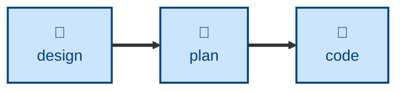

# Plan

The **plan** skill is all about decomposing delivery into small, stable
increments. It turns an agreed design into a sequenced checklist of small
construction steps that can be built through an iterative loop, so supporting
continuous integration.

The agent is told to find the thinnest end-to-end first slice, split the rest
of the work into steps that can each be merged, tested, and reverted on their
own, and order them so the unknowns are resolved before the laborious work
begins. Every step gets an observable pass/fail signal, a mode tag saying
whether it needs a human, and a note of any flag, fixture, or migration it
depends on. The agent writes the plan and stops: it is instructed not to touch
the code.

## Interactivity

This skill instructs the agent to run non-interactively, so it is suitable for
away-from-keyboard workflows. The agent will not ask questions about the
substance of the plan; if it cannot determine the design or its acceptance
criteria, it stops with an error instead. The one exception is locating
artifacts: the agent may ask where the design, specification, or plan store
lives when neither the session context nor the environment settles it.

## How to invoke

> Break this design into steps.

> Plan the implementation.

> How should we sequence this work?

## Recommended models

A frontier reasoning model, ideally with extended thinking, is best suited to
this task. Judging which steps carry real risk, and finding the thinnest slice
that still proves something end-to-end, is open-ended reasoning about a whole
system rather than a mechanical transformation.

## Suggested workflows

Run this once a design has been agreed and before any code is written. It is
an anti-pattern to re-run it per commit; instead, revise the existing plan as
the work teaches you things.

## Related skills

- [**design**](../design/) \
  Supplies the agreed architectural option and its trade-offs, which this
  skill decomposes into delivery steps.

- [**code**](../code/) \
  Picks up each step this plan produces, one at a time, and implements it.
