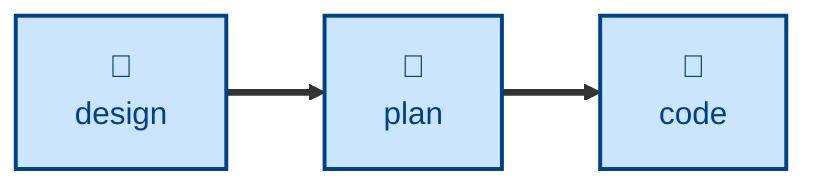

# Plan

The **plan** skill is all about decomposing delivery into small, stable
increments. It turns a big up-front design into a sequenced checklist of small
construction steps that can be built through an iterative loop, so supporting
continuous integration.

## Interactivity

This skill instructs the agent to run non-interactively.

## How to invoke

> Break this design into steps.

> Plan the implementation.

> How should we sequence this work?

## Recommended models

A frontier reasoning model, ideally with extended thinking, is best suited to
this task.

## Suggested workflows

## Related skills

- **[design](../design/).** Supplies the proposed architectural changes that
  this skill decomposes into work tasks.

- **[code](../code/).** Picks up each step this skill produces, one at a time.
