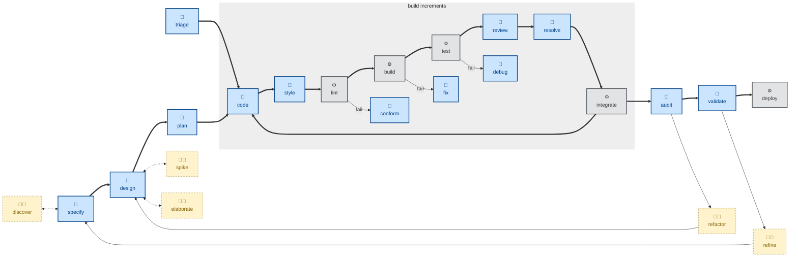

# 🤖 `plan`

The scope of this skill is to decompose a proposed design into a sequenced checklist of deliverable steps. This is a how a big up-front design can be implemented through an iterative loop of incremental construction steps — supporting continuous integration.

Steps are ordered by risk. The unknowns get tackled first, with the polish done last. It names the seams where flags, fixtures, or migrations decouple steps.

Use this skill when the change is substantially larger than a few atomic commits.

The skill instructs the agent to run non-interactively (🤖).

## How to invoke

- `/plan`, `/skill:plan` (prompts vary by harness).
- "Break this design into steps."
- "Plan the implementation."
- "How should we sequence this work?"

## Recommended models

Decomposing a design into small, safely sequenced, independently mergeable steps is a reasoning-heavy planning task. A frontier reasoning model, ideally with extended thinking, produces materially better sequencing than a mid-tier model, which tends to under-think dependencies between steps.
