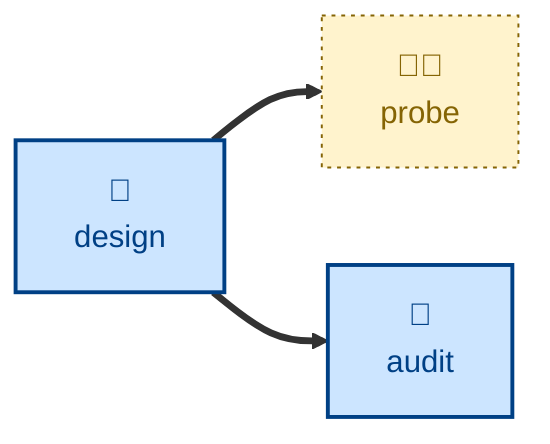

# Probe

The **probe** skill is all about running an interactive threat-modeling
workshop, and recording security risks.

The agent is instructed to facilitate a workshop in which the target system is
decomposed into its components, data flows, trust boundaries, and assets, then
each part of the system is assessed against one or more threat modeling
frameworks such as STRIDE, LINDUN, or OWASP. Every identified threat is rated
for likelihood and impact, which are tallied to yield an overall severity
score, which finally is used to rank the threats.

The agent is instructed to update a risk register with its findings.

This skill is discovery and record-keeping only. The agent is explicitly
instructed to NOT change the assessed code, and threat identification never
includes actively exploiting the system.

## Interactivity

This skill is interactive. The agent acts as a security analyst, facilitating
the session. The user answers as the business, technical, and security
stakeholders.

## How to invoke

> Probe the security of the payment flow.

> Run a threat model on the payment flow.

> What are the security risks of this design?

> Do a STRIDE session on the auth service.

> Assess the privacy risks here.

## Recommended models

A frontier model is best suited to this task.

## Suggested workflows

## Related skills

- **[design](../design/)** may trigger a threat-modeling session in response to major design changes.
- **[audit](../audit/)** is a companion skill that inspects a system's structural integrity.

## References

- [TS-54: Threat Modeling](https://github.com/kieranpotts/standards/tree/dev/src/054)
  is the technical standard that underpins this skill.

- [kieranpotts/risks](https://github.com/kieranpotts/risks) is a reference for
  a risk register maintained in Markdown files under version control.
