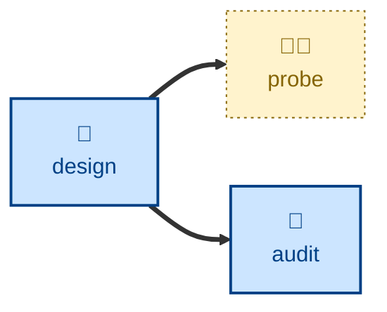

# Probe

The **probe** skill runs an interactive threat modeling workshop and records
the security and privacy risks it surfaces.

The agent is instructed to facilitate a workshop in which the target system is
decomposed into its components, data flows, trust boundaries, and assets, and
each part is then assessed against one or more threat modeling frameworks such
as STRIDE, LINDDUN, or the OWASP Top 10. Every identified threat is rated for
likelihood and impact, which combine into a severity by which threats are
ranked. Threats carrying residual exposure worth watching are promoted into
the project's living risk register; the rest stay in the session report.

The skill is discovery and record-keeping only. The agent is explicitly
instructed not to change the assessed system, and threat identification never
includes actively exploiting it. The agent stops once the report and the
register entries are written — it does not commit, branch, or file issues.

## Interactivity

This skill is interactive, and cannot be run away from the keyboard. The
agent acts as the security analyst facilitating the session, asking one
question at a time. The user answers as the business, technical, and security
stakeholders.

## How to invoke

> Probe the security of the payment flow.

> Run a threat model on the payment flow.

> What are the security risks of this design?

> Do a STRIDE session on the auth service.

> Assess the privacy risks here.

You can name the framework up front ("do a LINDDUN session on…") to skip that
question. Otherwise the agent asks, defaulting to STRIDE, and adds LINDDUN
where personal data is in scope.

## Recommended models

A premium frontier reasoning model. The task is open-ended adversarial
analysis conducted live with a human, and it depends on the model spotting
threats the participant has not thought of and pushing back on optimistic
ratings.

## Suggested workflows

Best run against a design that is settled enough to decompose, and re-run when
the architecture, the data handled, or the trust boundaries change materially.
Running it on every commit is an anti-pattern: the register fills with noise
and stops reflecting real risk.

## Related skills

- [**design**](../design/) \
  Records changes to a system's architecture. A significant design change is
  a natural trigger for a fresh threat modeling session.

- [**audit**](../audit/) \
  Companion skill that inspects a system's structural integrity, where this
  one inspects its exposure to attack.

## References

- [TS-54: Threat Modeling](https://github.com/kieranpotts/standards/tree/latest/dev/src/054)
  is the technical standard that underpins this skill.

- [kieranpotts/risks](https://github.com/kieranpotts/risks) is a reference for
  a risk register maintained in Markdown files under version control.
