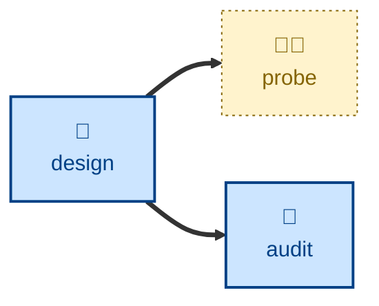

# Probe

The **probe** skill is all about running an interactive threat-modeling
session, and recording security risks. The agent
facilitates a workshop that decomposes a system into its components, data flows,
trust boundaries, and assets, then assesses each against one or more threat
modeling frameworks such as STRIDE, LINDUN, or OWASP. Every identified threat
is rated for likelihood and impact, which are tallied to yield an overall
severity score, which finally is used to rank the treats.

The agent is instructed to update a risk register with its findings, following
instructions provided in the risk register.

The agent acts as a security analyst, facilitating the session. The user (and
any participants they relay for) answers as the business, technical, and
security stakeholders.

This skill is discovery and record-keeping only. The agent is explicitly
instructed to NOT change the assessed code, and threat identification never
includes actively exploiting the system.

## How to invoke

> Probe the security of the payment flow.

> Run a threat model on the payment flow.

> What are the security risks of this design?

> Do a STRIDE session on the auth service.

> Assess the privacy risks here.

## Recommended models

Threat modeling is an interactive, adversarial-reasoning conversation. It runs
best on a frontier model that can hold copious context and surface non-obvious
attack paths, challenge optimistic likelihood estimates, and hold the whole
decomposition in view while assessing each boundary. These capabilities
noticeably degrade in smaller models.

## Suggested workflows

This skill complements the **[design](../design/)** and **[audit](../audit/)**
skills. Typically, threat modeling sessions will be triggered in response to
major changes to a system's design. Architectural reviews, which focus more on
the structural integrity of the design rather than its risk profile, may be
conducted in parallel.

## References

- [TS-54: Threat Modeling](https://github.com/kieranpotts/standards/tree/dev/src/054)
  is the technical standard that underpins this skill.

- [kieranpotts/risks](https://github.com/kieranpotts/risks) is a reference for
  a risk register maintained in Markdown files under version control.

- [STRIDE](https://en.wikipedia.org/wiki/STRIDE_model): Microsoft's pneumonic
  threat modeling framework is the RECOMMENDED baseline framework for threat
  classification.

- [LINDDUN](https://linddun.org/): A useful framework for extending STRIDE with
  privacy-oriented threat classifications. User this wherever
  personally-identifiable data exists in the target system.
