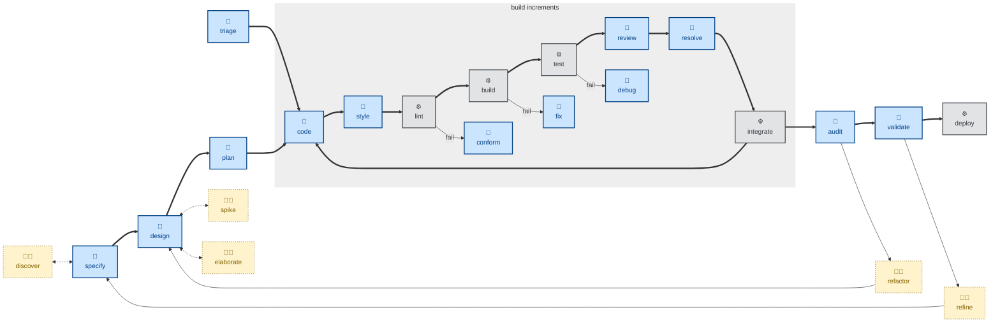

# 🤖 `refactor`

This skill restructures source code, while preserving existing behavior, to improve a single named target quality.

The agent is instructed to work in a sequence of small steps: rename one symbol, extract one function, inline one variable, etc. Each step compiles, passes tests, and could be independently reverted.

The outcome is restructured code with externally observable behavior identical, tests green throughout.

Use this skill on existing code that has comprehensive test coverage, especially at the system level. The skill works best when you have a target quality in mind: readability, data structures, coupling, naming, etc. Structural code qualities that require attention may be flagged by the architectural [`audit`](../audit/) skill.

Refactoring work is distinct from bug fixes and feature delivery.

This skill instructs the agent to run non-interactively (🤖).

## How to invoke

- `/refactor`, `/skill:refactor` (prompts vary by harness).
- "Refactor this for readability."
- "Clean up the structure of this module."
- "Reduce the coupling here without changing behavior."
