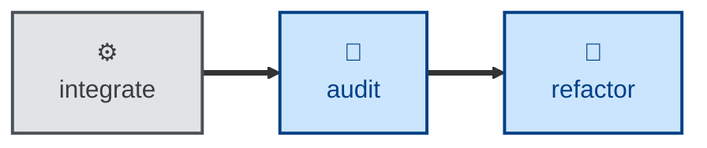

# Refactor

The **refactor** skill is all about iterating the design while maintaining
stability through system testing.

The agent is instructed to restructure source code, without changing observable
behavior, to improve a single named target quality — eg. readability, cohesion,
coupling, naming, decomposition.

The agent works in a sequence of small moves — eg. rename one symbol, extract
one function, inline one variable — each of which compiles, passes tests, and
could be independently reverted. The outcome is restructured code with all
externally-observable behavior identical to what it was before, and green tests
throughout. The test files themselves are never edited: they are the only
evidence that behavior held.

The agent stops at a series of committed refactoring moves. Reviewing them,
integrating the branch, and acting on anything the refactor surfaced — a bug, a
needed design change — are left to the caller.

You should only use this skill on an existing codebase that has comprehensive
test coverage, especially at the system level. Refactoring, especially by
agents, is not recommended on codebases with poor coverage.

## Interactivity

This skill instructs the agent to run non-interactively, so it suits
away-from-keyboard workflows, including continuous integration. The agent does
not prompt for answers to its questions. Where it cannot determine the target
code, the target quality, or the safety net, it stops with an error message
rather than guessing.

## How to invoke

> Refactor this for readability.

> Clean up the structure of this module.

> Reduce the coupling here without changing behavior.

Name the quality you want improved. The agent improves one quality per session,
so asking for several at once will get you the first one and a plan for the
rest.

## Recommended models

A frontier reasoning model, fine-tuned for programming tasks, is best suited to
this task. Small, well-scoped refactors can use a mid-tier coding model.

## Suggested workflows

Run this after a change has landed and the tests are green, typically on the
back of an audit that has surfaced structural drift. Do not run it on every
commit, and do not run it alongside feature work on the same branch — the point
of a refactor is a diff that contains nothing else.

## Related skills

- [**audit**](../audit/) \
  Surfaces the structural drift that this skill then acts on. Run it first to
  decide which quality is worth improving.

- [**design**](../design/) \
  Takes over when a move would redraw module boundaries, change a public
  interface, or alter the data model — changes this skill refuses to make.

- [**test**](../test/) \
  Builds the safety net this skill depends on. Use it first where coverage of
  the target code is thin.
