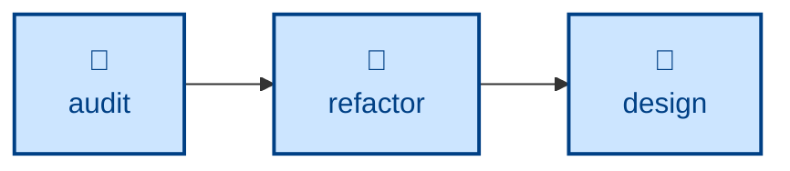

# Refactor

The **refactor** skill is all about iterating the design while maintaining
stability through system testing. It restructures source code, without
changing observable behavior, to improve a single named target quality.

The agent works in a sequence of small steps — rename one symbol, extract one
function, inline one variable — each of which compiles, passes tests, and could
be independently reverted. The outcome is restructured code with externally
observable behavior identical and tests green throughout.

Use it on existing code that has comprehensive test coverage, especially at the
system level, and when you have a target quality in mind: readability, data
structures, coupling, naming. Structural qualities worth attention are often
flagged first by the architectural **[audit](../audit/)** skill, whose report
feeds this one. Refactoring is distinct from bug fixes and feature delivery.

This skill instructs the agent to run non-interactively.

## How to invoke

> Refactor this for readability.

> Clean up the structure of this module.

> Reduce the coupling here without changing behavior.

## Recommended models

Improving internal quality without changing behavior requires judgment about
design trade-offs, so a frontier reasoning model is the safer default,
especially for anything beyond mechanical renames. Simple, well-scoped refactors
can run on a mid-tier coding model.

## Suggested workflows

**[audit](../audit/)** surfaces structural drift, **refactor** acts on it, and the
resulting structural changes flow back into the design record so the intended
architecture and the as-built one stay aligned.
