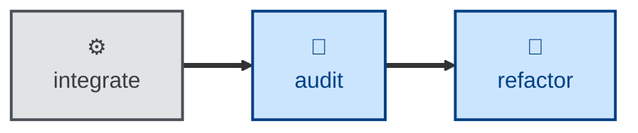

# Refactor

The **refactor** skill is all about iterating the design while maintaining
stability through system testing.

The agent is instructed to restructure source code, without changing observable
behavior, to improve a single named target quality — eg. readability, coupling,
data structures.

The agent works in a sequence of small steps — eg. rename one symbol, extract
one function, inline one variable — each of which compiles, passes tests, and
could be independently reverted. The outcome is restructured code but with all
externally-observable behavior being identical to what it was before, and green
tests throughout.

You should only use this skill on an existing codebase that has comprehensive
test coverage, especially at the system level. Refactoring, especially by agents,
is not recommended on codebases with poor coverage.

## Interactivity

This skill instructs the agent to run non-interactively. Therefore, the agent is
not expected to prompt for answers to its questions.

## How to invoke

> Refactor this for readability.

> Clean up the structure of this module.

> Reduce the coupling here without changing behavior.

## Recommended models

A frontier reasoning model, fine-tuned for programming tasks, is best suited to
this task. Small, well-scoped refactors can use a mid-tier coding model.

## Suggested workflows

## Related skills

- **[audit](../audit/)** surfaces the structural drift, which this skill can
  subsequently act on.

- The refactor skill updates the same design docs as the **[design](../design/)**
  skill does.
