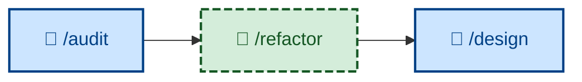

# 🤖 `/refactor`

Iterate the design while maintaining stability through system testing – improving the internal quality of existing code without changing its observable behavior, tests passing before and after, each step small and reversible. Runs non-interactively (🤖). Use when readability, structure, coupling, naming, or other design qualities need work. Distinct from bug fixes and feature work.



## What it does

`/refactor` restructures code against a single named target quality – it refuses aimless churn. It first names the quality it is improving (one of the nine design qualities: cohesiveness, simplicity, changeability, habitability, …), verifies a safety net of fast tests exists (adding characterization tests first as a separate prior step if coverage is thin), then plans the work as a sequence of *minute* moves – rename one symbol, extract one function, inline one variable – each of which compiles, passes tests, and could be reverted on its own. It executes one move at a time, committing each as a `refactor:` commit, then re-checks that the named quality actually improved (and reverts if it can't point at the gain). It applies the deletion test to decide whether to remove, keep, or deepen a module.

It is non-interactive, and behavior preservation is non-negotiable: the moment a move changes observable behavior – a real bug-fix urge, a "small feature while I'm here" – it stops, reverts to green, and routes that as a separate `fix:` or `feature:` task. A diff that grows the codebase substantially is treated as disguised feature work.

## How to invoke

```
/refactor
```

Invoke it on existing, tested code that needs internal improvement, with the target quality in mind. It takes the code and the quality to improve; no other arguments. (Within the workflow, `/audit` supplies the quality targets it acts on.)

## Examples

To improve cohesiveness in an `OrderService` that does parsing, pricing, and persistence, `/refactor` makes three moves – extract `OrderParser`, extract `PriceCalculator`, rename the remainder to `OrderRepository` – each a separate `refactor:` commit with all tests green, leaving three single-responsibility modules in place of one.

Mid-extraction it notices the original code silently accepted negative quantities while the new code throws. That's a behavior change, so it reverts the throw, opens a separate `fix:` commit and tracking issue, and resumes the refactor.
