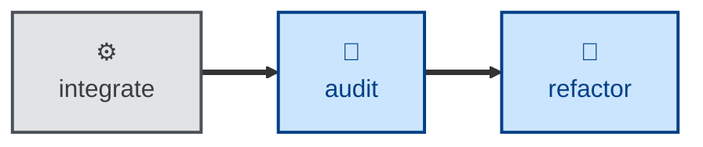

# Refactor

The **refactor** skill is all about iterating the design while maintaining
stability through system testing.

The agent is instructed to restructure source code, without changing observable
behavior, to improve a single named target quality — eg. readability, coupling,
data structures.

The agent works in a sequence of small steps — eg. rename one symbol, extract
one function, inline one variable — each of which compiles, passes tests, and
could be independently reverted. The outcome is restructured code but with all
externally-observable behavior being identical to what it was before, and green
tests throughout.

You should only use this skill on an existing codebase that has comprehensive
test coverage, especially at the system level. Refactoring, especially by agents,
is not recommended on codebases with poor coverage.

You may use the architecture **[audit](../audit/)** skill to surface potential
design improvements in a report, which can then be acted on by this skill.
The **refactor** skill will update the same design docs as those maintained by
the **[design](../design/)** skill, ensuring that architecture models and other
documentation is kept synchronized with changes made to the system.

This skill instructs the agent to run non-interactively. Therefore, the agent is
not expected to prompt for answers to its questions.

## How to invoke

> Refactor this for readability.

> Clean up the structure of this module.

> Reduce the coupling here without changing behavior.

## Recommended models

A frontier reasoning model, fine-tuned for programming tasks, is the safest
default, since refactoring requires careful judgment and deep knowledge of
system design trade-offs.

However, small, well-scoped refactors can be run on a good mid-tier coding
model.

## Suggested workflows

The **refactor** skill is designed to consume the same architecture audit
reports as generated by the **[audit](../audit/)** skill. Thus, the two
skills can be composed into agentic workflows in which the **audit** skill
surfaces structural drift, and subsequently the **refactor** skill acts on
it, implementing the suggested improvements in code.

## Related skills

- **[audit](../audit/):** surfaces the structural drift this skill acts on.

- **[design](../design/):** kept synchronized — this skill updates the same
  design docs the design skill maintains.
