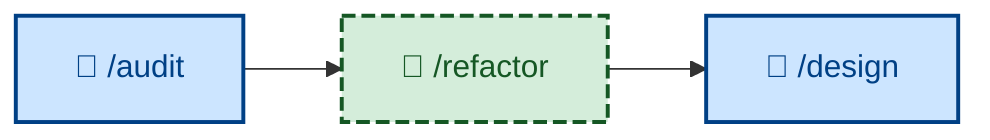

# 🤖 `/refactor`

<!-- /audit feeds into /refactor. While /audit does the actual evaluation of the evolving design, /refactor is responsible for putting any design improvements into action. /refactor is analogous to /refine, which serves the equivalent role in the product feedback loop. -->

Iterate the design while maintaining stability through system testing – improving the internal quality of existing code without changing its observable behavior, tests passing before and after, each step small and reversible. Runs non-interactively (🤖). Use when readability, structure, coupling, naming, or other design qualities need work. Distinct from bug fixes and feature work.

## What it does

`/refactor` restructures code against a single named target quality – it refuses aimless churn. It works as a sequence of *minute* moves – rename one symbol, extract one function, inline one variable – each of which compiles, passes tests, and could be reverted on its own, committing each as a `refactor:` commit, then re-checks that the named quality actually improved. The outcome is restructured code with externally observable behavior identical, tests green throughout.

It is non-interactive, and behavior preservation is non-negotiable: the moment a move changes observable behavior, it stops, reverts to green, and routes that as a separate `fix:` or `feature:` task.

## How to invoke

Invoke it on existing, tested code that needs internal improvement, with the target quality in mind. (Within the workflow, `/audit` supplies the quality targets it acts on.)

- `/refactor`, `/skill:refactor` (prompt varies by agent harness).
- "Refactor this for readability."
- "Clean up the structure of this module."
- "Reduce the coupling here without changing behavior."
