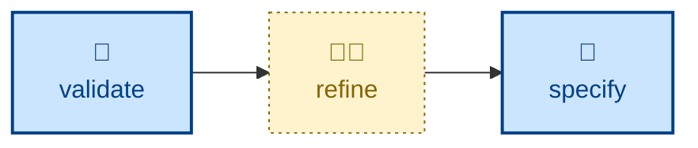

# Refine

The **refine** skill is all about producing new business requirements in
response to acceptance testing feedback. It edits the
*specification*, not the code, in response to acceptance-testing feedback or to
use of the working software. The boundary is sharp: if the spec was right and the
code was wrong, that is a defect fix, not a refinement; refinement is for when
the acceptance criterion itself is wrong, missing, contradictory, or ambiguous.

It drafts the edit in the specification's own conventions (Gherkin scenarios,
measurable NFRs, explicit out-of-scope) shown before-and-after, records the
rationale and evidence, and traces the downstream impact on design, plan, code,
and tests. It is disciplined: one logical change per pass, never a silent rewrite
of a passed AC, never scope expansion in disguise. It changes no code — the
output is a specification edit plus a traced impact list, ready to flow into
**[specify](../specify/)**.

It is the companion to **[validate](../validate/)**, which supplies the
suggestions it acts on, and it is analogous to **[refactor](../refactor/)**, which
serves the equivalent role for the design.

This skill is interactive where stakeholders must resolve a disagreement.

## How to invoke

> Refine the spec based on this feedback.

> The acceptance criteria are wrong — fix the requirements.

> Update the specification to match what we learned.

## Recommended models

Revising a specification from acceptance-testing feedback requires understanding
what was learned and why it invalidates existing acceptance criteria. A mid-tier
reasoning model is generally sufficient; escalate to frontier when the feedback
reveals a deeper misunderstanding of the requirements rather than a simple gap.

## Suggested workflows

**refine** closes the product feedback loop: **[validate](../validate/)** surfaces
where the specification diverged from the real need, **refine** edits the
specification, and the change flows back into **[specify](../specify/)**.
