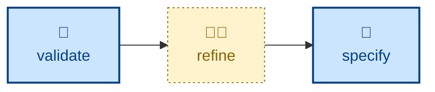

# Refine

The **refine** skill is all about producing new business requirements in
response to acceptance testing feedback.

The agent is instructed to edit the _specification_, not the code, in response
to acceptance-testing feedback or to real-world use of the working software.

The boundary is sharp: if the spec was right and the code was wrong, that is a
defect fix, not a refinement. Refinement is for when the acceptance criterion
itself is wrong, missing, contradictory, or ambiguous.

The agent drafts the edit in the specification's own conventions. It makes no
changes to code.

## Interactivity

This skill is interactive where stakeholders must resolve a disagreement.

## How to invoke

> Refine the spec based on this feedback.

> The acceptance criteria are wrong — fix the requirements.

> Update the specification to match what we learned.

## Recommended models

A mid-tier reasoning model is sufficient for this task. Escalate to a frontier
model for deeper misunderstandings of the requirements.

## Suggested workflows

## Related skills

- **[validate](../validate/)** is a companion skill that can be supply suggestions
  that this skill then acts on.

- **[specify](../specify/)** receives the specification edit this skill produces.

- **[refactor](../refactor/)** is the structural analogue to this skill.
