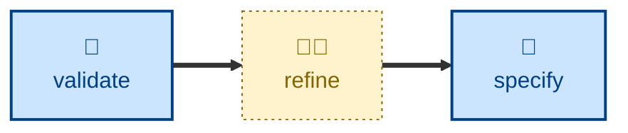

# Refine

The **refine** skill revises a requirements specification in response to
acceptance testing feedback, or to real-world use of the working software.

The agent is instructed to edit the _specification_, never the code. It names
the trigger and the evidence behind it, resolves where the requirements
actually live, classifies the change (correction, addition, removal,
reclassification, threshold adjustment), drafts the edit in the store's own
conventions as a before-and-after, files the rationale, and traces the
downstream impact on design, plans, code, and tests.

The boundary is sharp. If the specification was right and the code was wrong,
that is a defect fix, not a refinement. And a net-new capability is a new
specification, not a refinement of an old one.

## Interactivity

This skill is interactive. The agent may prompt for the trigger, the evidence
behind it, where the specification lives, and where rationale should be filed
— asking one question at a time. It is not suited to unattended runs, because
a refinement without a human-supplied trigger is guesswork.

## How to invoke

> Refine the spec based on this feedback.

> The acceptance criteria are wrong — fix the requirements.

> Update the specification to match what we learned.

Name the failing criterion, the measurement, or the stakeholder report in the
same breath, and the agent has less to ask for.

## Recommended models

A mid-tier reasoning model is sufficient for most refinements, which are
localized edits with a clear trigger. Escalate to a frontier model where the
feedback implies a deeper misreading of the requirements, or where the
downstream impact is wide.

## Suggested workflows

Run this after acceptance testing or a round of real use has produced
concrete feedback, and before any implementation work responds to it. Do not
run it to tidy a specification speculatively — with no trigger and no
evidence, there is nothing to refine against.

## Related skills

- [**validate**](../validate/) \
  Runs the acceptance checks whose failures supply this skill's triggers.

- [**specify**](../specify/) \
  Writes specifications from scratch. Take that route for a net-new
  capability, which is out of scope here.

- [**refactor**](../refactor/) \
  The structural analogue: refactor improves the shape of code without
  changing behavior, refine improves the shape of requirements without
  changing the underlying need.
