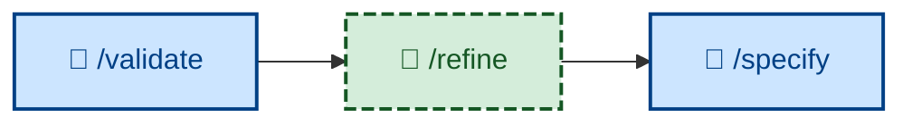

# 🧑 `/refine`

<!-- /validate feeds into /refine. While /validate does the actual evaluation of the evolving product, /refine is responsible for putting the findings into action. /refine is analogous to /refactor, which serves the equivalent role in the design feedback loop. -->

Revise the requirements specification in response to acceptance testing feedback – or to use of the working software. Interactive (🧑) where stakeholders must resolve a disagreement. Use when testing surfaces a specification gap, a stakeholder reports an unmet need against shipped behavior, or an NFR threshold turns out to be wrong in practice.

## What it does

`/refine` edits the *specification*, not the code. The boundary is sharp: if the spec was right and the code was wrong, this is a defect fix, not a refinement; refinement is for when the acceptance criterion itself is wrong, missing, contradictory, or ambiguous. It drafts the edit in the specification's own conventions (Gherkin scenarios, measurable NFRs, explicit out-of-scope) shown before-and-after, records the rationale and evidence, and traces the downstream impact on design, plan, code, and tests.

It is interactive where stakeholders disagree, and disciplined elsewhere: one logical change per pass, never a silent rewrite of a passed AC, never scope expansion in disguise. It changes no code – the output is a specification edit plus a traced impact list, ready to flow into `/specify`.

## How to invoke

Invoke it when feedback proves the specification itself needs to change. (Within the workflow, `/validate` supplies the suggestions it acts on.)

- `/refine`, `/skill:refine` (prompt varies by agent harness).
- "Refine the spec based on this feedback."
- "The acceptance criteria are wrong – fix the requirements."
- "Update the specification to match what we learned."
