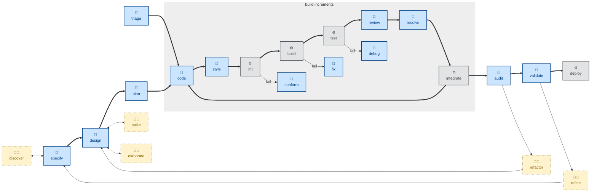

# 🧑 `reflect`

`reflect` = durable lesson capture. It distills *working-style* continuity — how to collaborate well with this user, in this codebase — as distinct from task state (which belongs in a handoff document). It scans the conversation for durable lessons (corrections, quietly-accepted non-obvious choices, revealed preferences, project decisions not in version control), filters ruthlessly (anything derivable from the code, any standard best practice, any one-off detail is dropped), and walks each surviving candidate past the user for approval before persisting it to memory or convention files.

Use it at the end of a session to make future sessions start smarter. With no argument it scans the whole conversation; expect a per-candidate walk-through, then a short report of what was saved. It says so plainly when a session contained nothing worth saving.

It is the companion to [`handoff`](../handoff/).

It is interactive — one candidate at a time, no batching, because batching invites blind approval (🧑).

## How to invoke

- `/reflect`, `/skill:reflect` (prompts vary by harness).
- "Reflect on this session."
- "What should you remember from this?"
- "Save the lessons from our work today."

## Recommended models

Extracting durable lessons from a session is a synthesis task over a conversation the model already has in context. A mid-tier model is sufficient — the bar is faithful, well-organized extraction, not novel reasoning.
