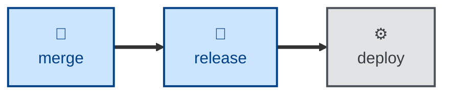

# Release

The **release** skill encapsulates the rules for cutting release branches defined in
[TS-9: Version Control](https://github.com/kieranpotts/standards/tree/latest/dev/src/009).

The skill defines two mutually exclusive release strategies: a single
permanent `release` trunk , or `release/<version>` branches.

## Interactivity

This skill instructs the agent to run non-interactively.

## How to invoke

> Cut a release.

> Tag version X.

> Prepare a release branch.

## Recommended models

A small, fast model is sufficient for this task.

## Suggested workflows

## Related skills

- **[branch](../branch/).** Defines the trunks that release branches are cut
  from.

- **[commit](../commit/).** Creates the revisions that a release is assembled
  from.

- **[merge](../merge/).** Integrates release branches back into the trunks.
