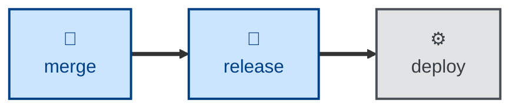

# Release

The **release** skill is all about **release branching and tagging**. It defines
two mutually exclusive release strategies and the rules for each: a single
permanent **release** trunk auto-promoted from `ready` (for continuous
deployment), or `release/<version>` branches cut from `ready` (for release
trains). It applies the chosen strategy — cutting from the `ready` trunk tip,
tagging with annotated `v<version>` tags, and promoting the `[Unreleased]`
changelog section to a versioned, dated heading.

Use it to choose a strategy, cut a release branch, or tag a version. Describe
the release context and it applies the matching strategy, names the branch/tag,
and handles the changelog promotion.

It is the final git-workflow skill, taking the trunk that **[merge](../merge/)**
has promoted to `ready` and shipping it.

This skill instructs the agent to run non-interactively; it is
reference-and-apply.

## How to invoke

> Cut a release.

> Tag version 2.1.0.

> Prepare a release branch.

## Recommended models

Release branching and versioning follow a fixed convention, so a small, fast
model is sufficient. This is rule application, not judgment.

## Suggested workflows

**release** cuts from the `ready` trunk that **merge** has promoted, tags the
version, and hands a tagged artifact to the scripted deploy step.
