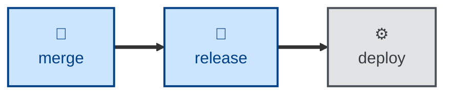

# Release

The release skill encapsulates the rules for cutting release branches and
applying version tags, as defined in
[TS-9: Version Control](https://kieranpotts.com/standards/009).

It instructs the agent to work out which of two mutually exclusive release
strategies the project uses — a single permanent `release` trunk, or temporary
`release/<version>` branches — and then to cut or advance that branch from the
release-ready trunk, promote the changelog's unreleased section, apply an
annotated version tag, ship the build to the project's artifact registry, and
draft user-facing release notes.

The agent is told not to touch the software's own source code or
configuration, and not to commit fixes to a release branch.

## Interactivity

This skill instructs the agent to run non-interactively. It resolves the
release model, tagging convention, version, changelog, and artifact registry
from the surrounding context and the project itself, and stops with an error
rather than asking the user. It is therefore suitable for away-from-keyboard
and continuous integration workflows.

## How to invoke

> Cut a release.

> Tag version 1.2.0.

> Prepare a release branch.

> Ship the release.

## Recommended models

A small, fast model is sufficient. The work is a mechanical application of a
documented branching and tagging convention, with no open-ended analysis.

## Suggested workflows

Run this once the release-ready trunk holds the revisions you intend to ship,
after integration and before deployment. Do not run it per commit: a release
is a deliberate act, and version tags are permanent.

## Related skills

- [**branch**](../branch/) \
  Defines the trunks that release branches are cut from. Run it to establish
  the branch model this skill then assumes.

- [**commit**](../commit/) \
  Creates the revisions that a release is assembled from, including the
  release commit that carries the promoted changelog.

- [**merge**](../merge/) \
  Integrates release branches back into the trunks once a release has shipped.

## References

- [TS-9: Version Control](https://kieranpotts.com/standards/009) \
  The technical standard that defines the release branching and version
  tagging conventions encoded here.
