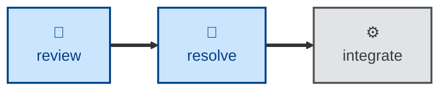

# Resolve

The **resolve** skill is all about actioning the open review comments on a
pull request, and marking them as resolved.

The agent is instructed to take every comment thread still open on the pull
request, implement the change it asks for, verify the change with a test,
reply with what changed and where, and then mark the thread resolved. The
fixes are committed separately from the commits under review, and the branch
is pushed for re-review.

It assumes the review has already been curated, such that every comment still
open requires a resolution. Comments that need no action are assumed to have
been resolved already by the author.

Any comment the agent cannot action is left open and reported, with a reason.
The skill stops at that point — it does not merge, close, or otherwise
advance the pull request.

## Interactivity

This skill instructs the agent to run non-interactively. It never blocks for
user input, so it is suitable for away-from-keyboard and CI workflows. Where
it cannot determine the pull request, the review host, or the base commit, it
stops with an error instead of asking.

## How to invoke

> Action the review comments.

> Address the feedback on this PR.

> Resolve the open review threads on #482.

## Recommended models

A mid-tier coding model is sufficient for this task, since each comment
names the change it wants. Escalate to a frontier model where the review
comments are ambiguous, or where the fixes interact with each other.

## Suggested workflows

Run this after a review has been left and curated, and before the change goes
back for re-review or integration. Do not run it against a review that has
not been curated: the skill implements everything left open, so an untriaged
review will be implemented in full.

## Related skills

- [**review**](../review/) \
  Leaves the comments that this skill then actions. Curate its output before
  running this skill, since every comment left open gets implemented.
