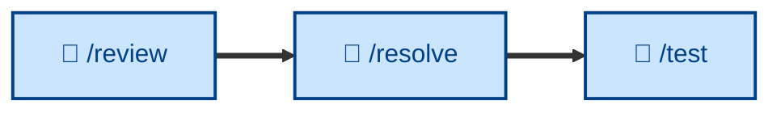

# 🤖 `/resolve`

<!-- Input: commented PR. Outcome: PR comments resolved (or commented on further if cannot be resolved. -->

Action open review comments, then mark as resolved – implementing each one in code and verifying it. Runs non-interactively (🤖). The counterpart to [`/review`](../review/) – review posts the comments, `/resolve` actions them.

## What it does

`/resolve` takes the comments a review left open on a PR and turns each into a verified code change. It assumes the author has already curated the review – every comment still open is one to implement, so it does not negotiate or reject. For each, it makes the smallest faithful change, verifies it, replies on the thread, and marks it resolved. Fixes land in their own commit, separate from the original implementation, so each review round stays legible in the history.

It runs non-interactively. Anything it genuinely cannot action is left open and reported with a reason, never silently skipped.

## How to invoke

Invoke it on a pull request once a review has posted its comments and the author has dismissed the ones they don't want actioned.

- `/resolve`, `/skill:resolve` (prompt varies by agent harness).
- `/resolve PR #482`
- "Action the review comments."
- "Address the feedback on this PR."
