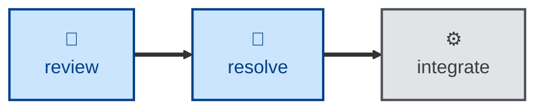

# Resolve

The **resolve** skill is all about actioning open review comments, and marking
them as resolved.

The agent is instructed to takes the comments left on an open pull request,
to review each in turn, and respond with a comment and — where appropriate — a
code change.

It assumes the user has already curated the review, such that every comment still
open requires resolution. Comments that do not require a resolution are assumed
to be already closed and marked as resolved.

Any comment the agent cannot action is left open, with a comment explaining why
it was skipped.

## Interactivity

This skill instructs the agent to run non-interactively.

## How to invoke

> Action the review comments.

> Address the feedback on this PR.

## Recommended models

A mid-tier coding model is sufficient for this task. Escalate to a frontier
model for ambiguous review comments.

## Suggested workflows

## Related skills

- **[review](../review/)** leaves the comments this skill then actions.
