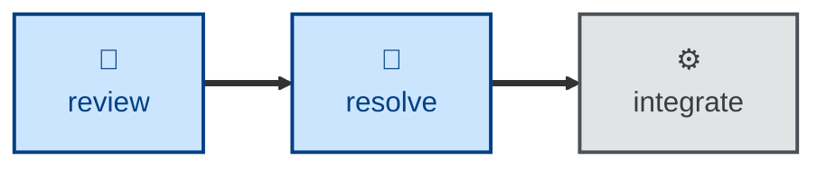

# Resolve

The **resolve** skill is all about actioning open review comments, and marking
them as resolved. It takes the
comments left on an open pull request, reviews each in turn, and responds with a
comment and — where appropriate — a code change.

It assumes the user has already curated the review, such that every comment still
open requires resolution; comments that do not require a resolution are assumed
to be already closed and marked as resolved. It is the counterpart to
**[review](../review/)**, which performs static analysis on a PR's diff and leaves
the comments that **resolve** then actions.

This skill instructs the agent to run non-interactively. Any comment it cannot
action is left open, with a comment explaining why it was skipped.

## How to invoke

> Resolve PR #482

> Action the review comments.

> Address the feedback on this PR.

## Recommended models

Actioning review comments is implementation work against an already-specified
fix, so a mid-tier coding model is usually sufficient. Escalate to a frontier
model only when a review comment is ambiguous enough to require re-deriving
intent.

## Suggested workflows

**resolve** closes the loop after **[review](../review/)**: it actions the open
comments so the increment can proceed to the scripted integrate step.
