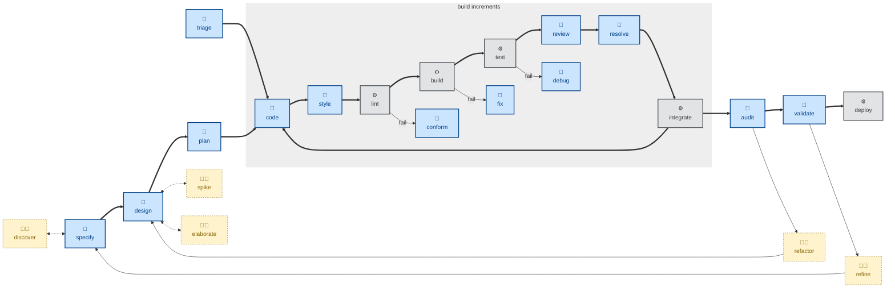

# 🤖 `resolve`

The skill instructs the agent to take the comments left on an open pull request, to review each in turn, and responding with a comment and — where appropriate — a code change.

The agent is instructed to assume that the user has already curated the review, such that every comment still open requires resolution. Comments that do not require a resolution are assumed to be already closed and "marked as resolved".

This skill is the counterpart to [`review`](../review/), which performs static code analysis on a PR's diff and leaves comments. `resolve` actions those comments.

This skill instructs the agent to run non-interactively (🤖). Any comments that the agent cannot action are left open, with a comment left by the agent to explain why it was skipped.

## How to invoke

- `/resolve`, `/skill:resolve` (prompts vary by harness).
- `/resolve PR #482`
- "Action the review comments."
- "Address the feedback on this PR."

## Recommended models

Actioning review comments is implementation work against an already-specified fix, so a mid-tier coding model is usually sufficient. Escalate to a frontier model only when a review comment is ambiguous enough to require re-deriving intent.
