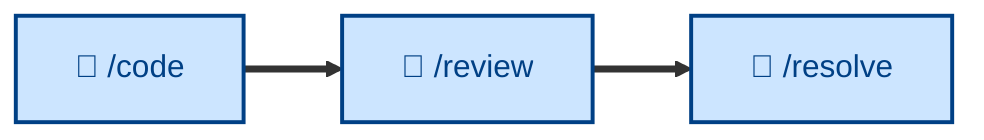

# 🤖 `/review`

<!-- Input: code PR. Outcome: commented PR. -->

<!-- "in the small" - its reviewing just a small incremental change in code - a step toward realizing a bigger feature or runtime behavior. Evaluates against specified standards. -->

<!-- Criteria: is this code change sound, against conventions? -->

<!-- Distinct from /audit - which looks at the evolving architecture and feeds back to the design docs. -->

Evaluate code for style conventions and pattern consistency, focusing on static qualities – auditing a change for correctness, design, clarity, test coverage, security, and completeness, and classifying every finding as blocking or non-blocking. Runs non-interactively (🤖). Use when reviewing a pull request, auditing a peer's branch, or self-reviewing changes before opening a PR.

## What it does

`/review` evaluates a change as a *piece of work* against static qualities – it does not run the system end-to-end (that's verification) or chase a failing test (that's diagnosis). It checks correctness, design, clarity, test coverage, security, and completeness, writing findings that are specific and actionable, each carrying a severity (Blocking, Suggestion, Nit, Praise) and organized along two axes: **Specification** (does it faithfully implement the issue/ACs) and **Standards** (does it conform to the repo's conventions). It closes with an explicit verdict: Approve, Request changes, or Comment.

It is non-interactive and surfaces findings without fixing them – fixing, restructuring, and re-running are downstream responsibilities. It approves at "good enough", not "perfect".

## How to invoke

Invoke it on a PR, a peer's branch, or your own diff before opening a PR. Self-review runs the identical procedure. Give it the change and the spec/ACs it claims to satisfy; it pins the base itself if not told.

- `/review`, `/skill:review` (prompt varies by agent harness).
- "Review this PR."
- "Review my changes before I push."
- "Check this diff against the spec and our conventions."
