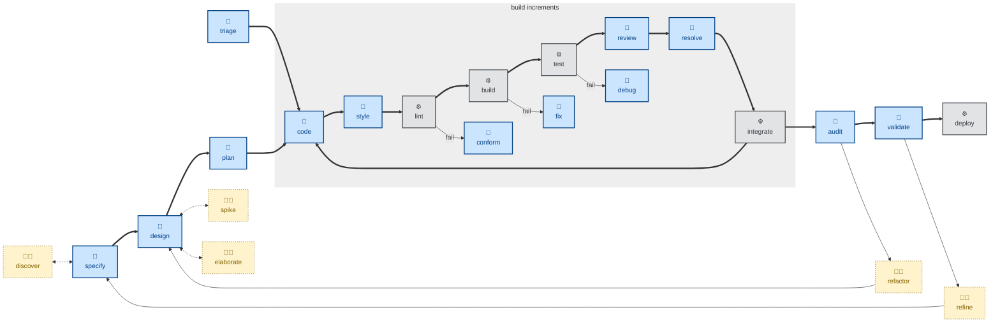

# 🤖 `review`

Performs code review.

This skill instructs the agent to statically analyze the diff in an open pull request.

The agent is instructed to check correctness, design, clarity, test coverage, security, and completeness, writing findings that are specific and actionable, each carrying a severity (blocking, suggestion, nitpick, praise) and organized along two axes:

- **Specification**: Does it faithfully implement the issue/ACs.
- **Standards**: Does it conform to the repo's conventions.

It closes with an explicit verdict, one of:

- Approve
- Request changes
- Comment

Use this skill when auditing a coworker's branch, or self-reviewing changes before opening a PR.

The agent is instructed to surface findings without fixing them. Orchestrators may handoff to the [`resolve`](../resolve/) skill to resolve open PR comments.

For a wider architectural review, refer to the [`audit`](../audit/) skill.

This skill instructs the agent to run non-interactively (🤖).

## How to invoke

- `/review`, `/skill:review` (prompts vary by harness).
- "Review this PR."
- "Review my changes before I push."
- "Check this diff against the spec and our conventions."

## Recommended models

Reviewing a change for correctness, design, security, and completeness is judgment-heavy and adversarial by nature — you're looking for what the author missed. Use a frontier reasoning model; mid-tier models tend to under-report subtle defects and over-report style nitpicks.
